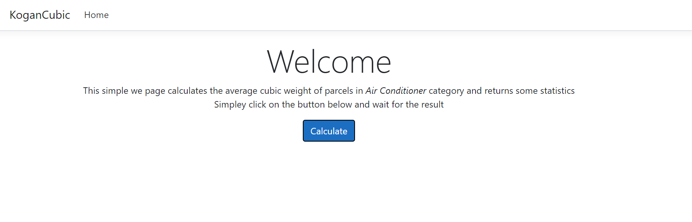
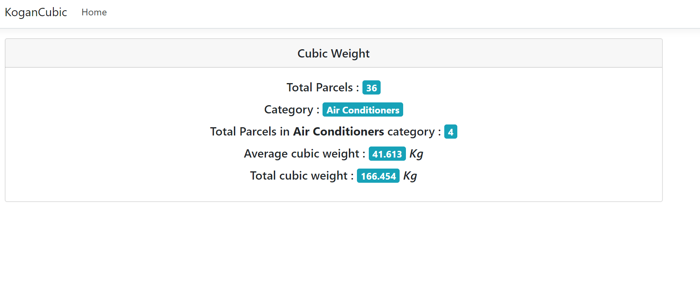
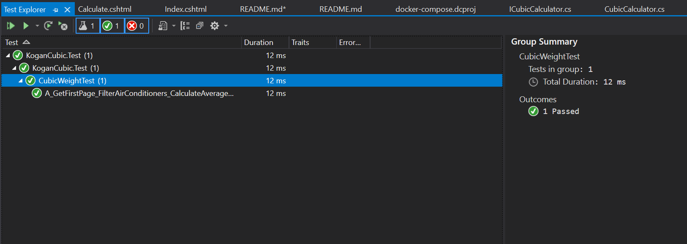

# Cubic weight calculator

### Solution Structure and Programming Language 
1. This solution is implemented using .Net Core version 3.1 and runs as a `ASP.Net MVC` application 
2. The programming language used for implementation is `C#`

3.  The root directory contains README file, solution file and projects folders  

4. Following bullet points explains about projects and their structure.
--- 
 - <b> KoganCubic</b>
    - This project is the .net core MVC application. It calls the API endpoint <b>asynchronous</b>   - The `Home` controller implements  `Calculate` action and calls the `Calculate` service . 
    - The `Calculate` class has dependency on `CalculaterClient` for getting the content from API. The `Calculator` service makes continuous calls to pages of API and calculates the parcel's 'Cubic weight' in `Air conditioner` category
    - The `CalculatorClient` class has dependency on singleton object of .Net `HttpClient` and its responsibility is to fetch and deserialize the  API response 
    - The `Model` folder contains the `POCO` classes including the API response and calculation response
- <b>KobagCubic.Test </b>
  - This is the unit test project of the solution. 
  - Unit test implements `ICalculatorClient` as fake client and returns mock data
  - Unit test class initialize the object of type `ICalculator` and pass the fake `ICalculatorClient`
  - One unit test is covering the following  scenario
  - Call the fake client method and check the number of objects with `Calculator` response 
  - Calculate the average cubic weight and compare it with response average weight.
  
- <b>docker-compose project </b>
  - This is the docker compose project which pulls .net core images and build the web project 
  - It runs the backend on port 5001.
  
### Good practices implemented in this coding challenge
- Asynchronous Programming : To avoid UI freeze, client and services calculate and return the data in asynchronous format.
- Single responsibility : Each class and service like `Calculator` and `CalculatorClient` is responsible for a single and isolated task.
- Dependency Injection : by using the built-in DI container of .Net core framework, each class simply accept its dependency and DI container is responsible to resolve the scope and type of dependencies. 

#### How to run the project using docker 

1. Docker desktop must be up and running
2. In order to build and run application, execute in the root folder the following commands : `docker-compose build` and after that `docker-compose up` 
3. When the `docker-compose up ` job is finished, access the application using this url : http://localhost:5001

#### OR  run the project using visual studio
1. Open the solution `sln` file in visual studio
2. right click on `KoganCubic ` project and set as Startup project
3. Click on `IIS Express` and it should display the home page in browser : https://localhost:44387/

<b>Example of the screen when application loads</b>

<b>Example of the screen of Average cubic weight report</b>

<b> Test result </b>

